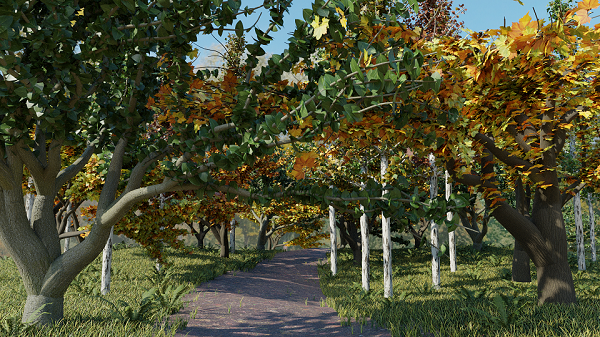
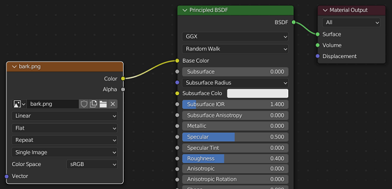
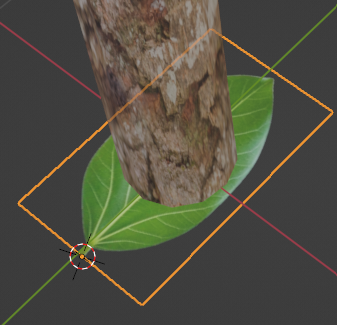
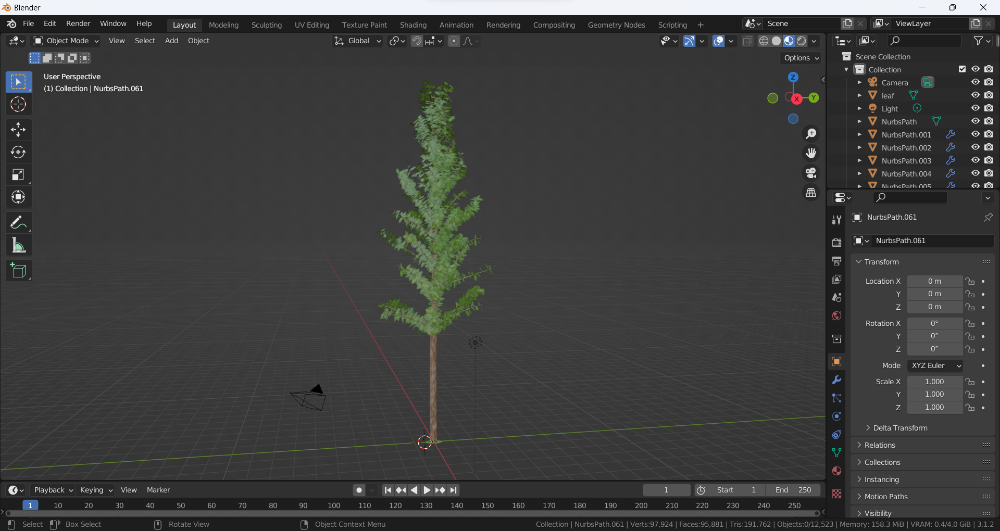

# Automated tree generation using grammar & particle system

This is the official implementation of the paper `Automated tree generation using grammar & particle system`.

<p align="center">
  
</p>


* `grammar` folder: This folder contains a library of grammar files that are used for generating trees of Indian and Western species.
* `Grammar-Trees-main.zip`: This file is a Blender plugin that enables the generation of trees within Blender.
* `code.py`: This file contains the code that can be directly utilized in the Blender scripting tab for tree generation.

## Steps to generate the tree

1. Open Blender and delete the default cube.
2. You have to perform this step only once: `Edit > Preferences > Add-ons > Import Image as Planes`.
3. Download leaf and bark textures. For leaf texture, make sure that the alpha is zero for the background. Sample leaf and bark textures are given in the texture folder.
4. Go to the `Scripting` tab in Blender, click `+ New` and copy-paste the content of  `code.py` there.
5. Make the following changes in the code:
   1. In line 87, replace `leaf` with the name of the leaf texture file. For example, if the name of the leaf texture is `aspen.png`, then the line would read `bpy.data.objects["aspen"]`. Note that the sample texture is `leaf.png` so you don't have to make any changes if you use that.
   2. In line 226, replace the `path/to/texture/file.png` with the path of the leaf texture. For example, if the path is `/root/texture/aspen.png`, then line 226 would read `"name":"/root/texture/aspen.png"`. Make sure to use `/` rather than `\` for the path, even on windows.
   3. Although redundant, repeat the same step for line 227.
   4. For line 228, repeat the same step without the file name. For example, the line would read `directory="/root/texture/"`.
6. Hit the `Run Script` button (triangle on top) or use the shortcut `Alt p`.
7. Change from the default `Solid` to `Material Preview` or `Rendered` to view textures.
8. For the bark texture:
   1. Go to the shading tab and `Add > Texture > Image Texture`.
   2. Connect `Color` in `Image Texture` to `Base Color` in `Principled BSDF`.
   3. Click `Open` in `Image Texture` and select the bark texture. The image below illustrates the nodes.

<p align="center">
  
</p>

9. You might observe that the leaves are at the center of the barks. To correct it, select the main leaf plane on the bottom of the first trunk of the tree. Change its origin to the starting tip of the leaf. You can do this by `selecting Cursor from left panel and place it at the tip of the leaf > select the leaf plane object at the bottom of the trunk > right click > Set origin > Origin to 3D cursor.` This would make sure that the leaves start from the tips rather than their center from the barks. The image below illustrates the leaf to be edited and the placement of the cursor.

<p align="center">
  
</p>

You should have something like this:

<p align="center">
  
</p>

To generate a different tree, replace the value of the `parameters` variable in line 115 with parameters of a different tree present in the `grammar` folder.

The blender add on is present in the file: `Grammar-Trees-main.zip` and has a standard installation. You can refer the following link for more on how to install and activate an addon: [How to Install and Activate Add-Ons in Blender 3+](https://brandonsdrawings.com/how-to-install-and-activate-add-ons-in-blender/).


## Links

Paper link: https://dl.acm.org/doi/pdf/10.1145/3490035.3490285

Project Page (3dcomputervision): https://3dcomputervision.github.io/publications/tree_generation_icvgip

Project Page (CVIT): https://cvit.iiit.ac.in/research/projects/cvit-projects/automated-tree-generation-using-grammar-particle-system

Video Link: https://youtu.be/wIaY3GgnyX0


## BibTex

```
@inbook{10.1145/3490035.3490285,
  author = {Jain, Aryamaan and Sunkara, Jyoti and Shah, Ishaan and Sharma, Avinash and Rajan, K S},
  title = {Automated Tree Generation Using Grammar &amp; Particle System},
  year = {2021},
  isbn = {9781450375962},
  publisher = {Association for Computing Machinery},
  address = {New York, NY, USA},
  url = {https://doi.org/10.1145/3490035.3490285},
  booktitle = {Proceedings of the Twelfth Indian Conference on Computer Vision, Graphics and Image Processing},
  articleno = {26},
  numpages = {9}
}
```

